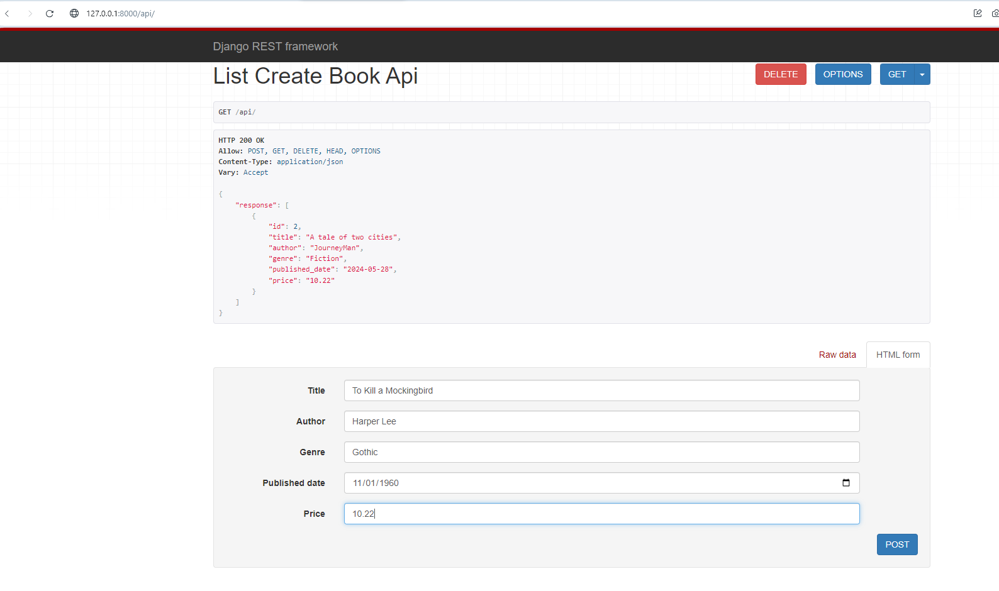
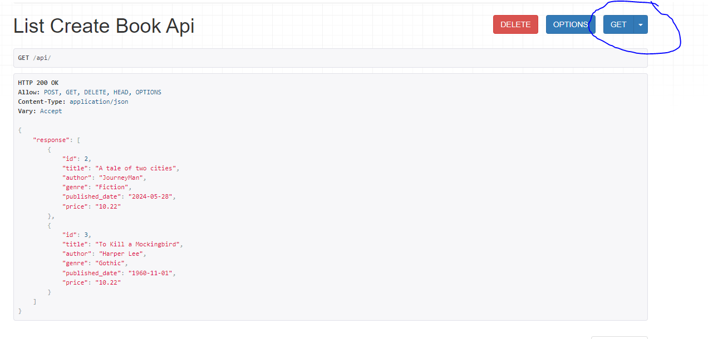
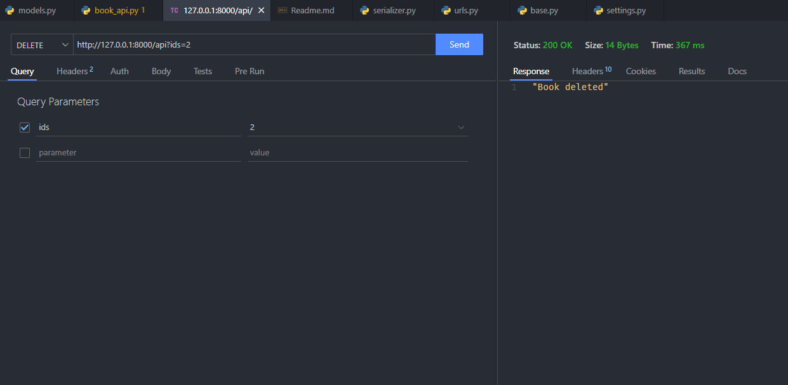
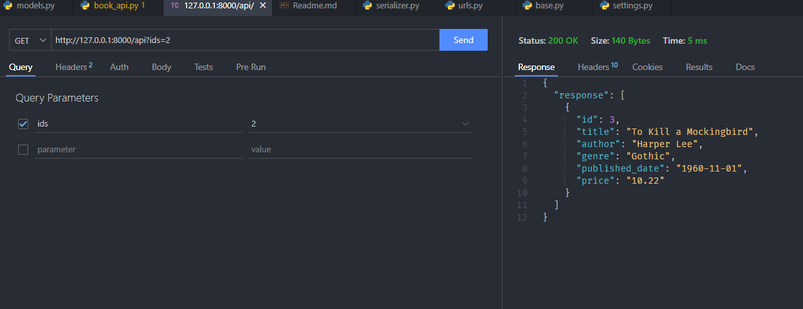
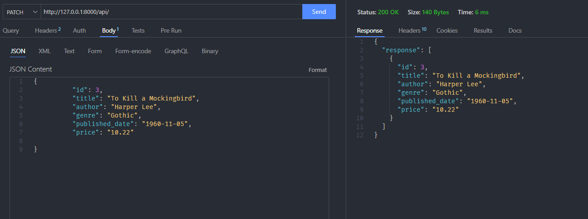

# Demo Book CRUD app

Uses Djago Rest framework's API view for implementing a simple CRUD app of a book store.

## Installation

Use requirements.txt to install all reqs for this project
`pip install -r  requirements.txt`

## Usage

To run the app cd into 'bookstore' from this repo's root and run `python manage.py runserver`

Navigate to http://127.0.0.1:8000/api/ and create and list out all the entries from the DRF's web frontend.

To create an entry, enter the book details and click on post

To list all entries, click on get

To delete an entry, enter the id as a query param with the ID to be deleted

To update entries specify the updtaed fields in the body of patch request

